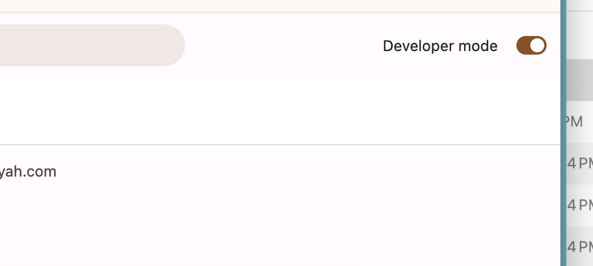
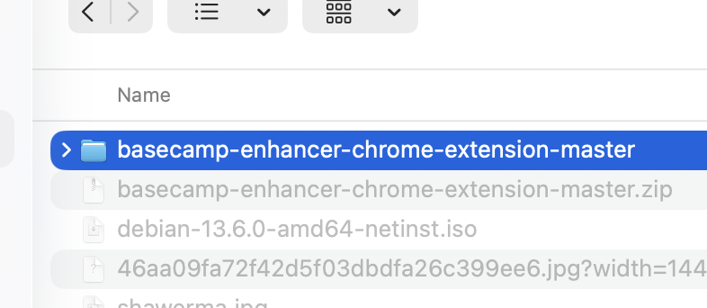

#  Basecamp Enhancer

<div dir="rtl">

إضافة كروم صغيرة تشتغل **فقط على Basecamp** وتضيف خمس تحسينات، كلها تشتغل تلقائيًا وباستمرار:

1. **توقيت نسبي** — يضيف «(قبل X)» بجانب كل تاريخ، مثل `Jun 2 (6 days ago)`.
2. **إجبار الاتجاه RTL** — النص العربي ينعرض يمين-إلى-يسار حتى لو بدأ السطر بكلمة إنجليزية أو رقم، والكتابة بالعربي في خانات الإدخال تتجه صح وأنت تكتب.

   
3. **تفاعلات سريعة** — إيموجي بضغطة واحدة بدون فتح قائمة «…»، وتقدر تغيّر المجموعة وترتيبها من الإعدادات (الترتيب ثابت مثل ما تحطه).
4. **شريط إجراءات عند التمرير** — شريط بأسلوب Google Chat يظهر فوق الرسالة لما تمرّر عليها: إيموجي التفاعل + قائمة الإجراءات كاملة (رد، تعديل، حفظ، نسخ الرابط، حذف…) بدون ما تفتح أي قائمة.

   
5. **خط ثمانية** — بدّل خط Basecamp كله إلى **IBM Plex Sans Arabic** (الخط اللي يستخدمه موقع ثمانية) أو أحد خطوط ثمانية الأخرى، من قائمة في الإعدادات.

## التثبيت — خطوة بخطوة (ما يحتاج أي خبرة)

1. **حمّل الإضافة**: [اضغط هنا لتنزيل ملف ZIP](https://github.com/fhijazi-thmanyah/basecamp-enhancer-chrome-extension/archive/refs/heads/master.zip)
2. **فك الضغط** عن الملف (دبل-كليك عليه) — بيطلع لك مجلد.
3. افتح كروم واكتب في شريط العنوان: `chrome://extensions` واضغط Enter.
4. فعّل **Developer mode** (المفتاح اللي فوق على اليمين):

   
5. اضغط **Load unpacked** واختر المجلد اللي طلع لك من فك الضغط:

   
6. افتح [app.basecamp.com](https://app.basecamp.com) (لازم تكون مسجّل دخول) — وبس، كل شيء يشتغل.

## الإعدادات

اضغط أيقونة الإضافة في شريط كروم: كل ميزة لها مفتاح مستقل، والتغييرات تنطبق **فورًا** على تبويبات Basecamp المفتوحة بدون إعادة تحميل. أطفئ كل المفاتيح = يرجع Basecamp عادي تمامًا.

> **ملاحظة:** فيه ميزة تجريبية إضافية (Claude Code launcher — تشغّل وكيل Claude على المحادثة) لكنها **مطفأة ومخفية** في النسخة المنشورة لأنها تحتاج خادم محلي. تفاصيل تشغيلها تحت.

</div>

## Backend setup (Claude Code launcher only)

Only needed for builds with `CC_ENABLED = true` (the launcher is off and hidden in the published build). The backend is [cc-tmux-api](https://github.com/FarisHijazi/cc-tmux-api) — a small local daemon on `127.0.0.1:8377` that spawns/lists/kills the workers (tmux-backed, revives them after reboot).

1. [Claude Code](https://code.claude.com) installed and signed in; run `/config` inside any session and set **"Enable Remote Control for all sessions"** to `true` (this gives each worker its shareable `claude.ai/code/session_…` link).
2. `brew install uv tmux`
3. Create the workspace dir and start the backend (`BCE_WORKSPACE_DIR` is its base dir; each session keeps its files under `$BCE_WORKSPACE_DIR/workspace/<session-id>/`):

   ```bash
   export BCE_WORKSPACE_DIR="${BCE_WORKSPACE_DIR:-$HOME/.basecamp-enhancer}"
   mkdir -p "$BCE_WORKSPACE_DIR/workspace"
   uvx git+https://github.com/FarisHijazi/cc-tmux-api
   ```

If the extension can't reach the backend, the launch popover shows this same command inline.
