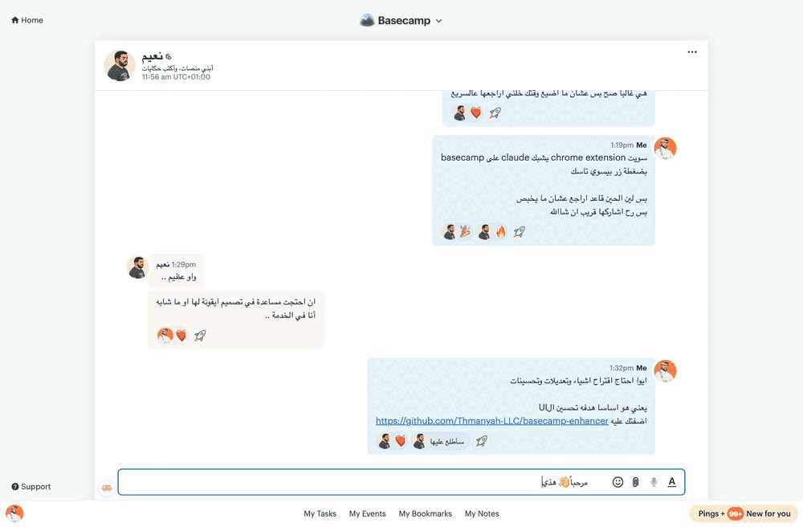
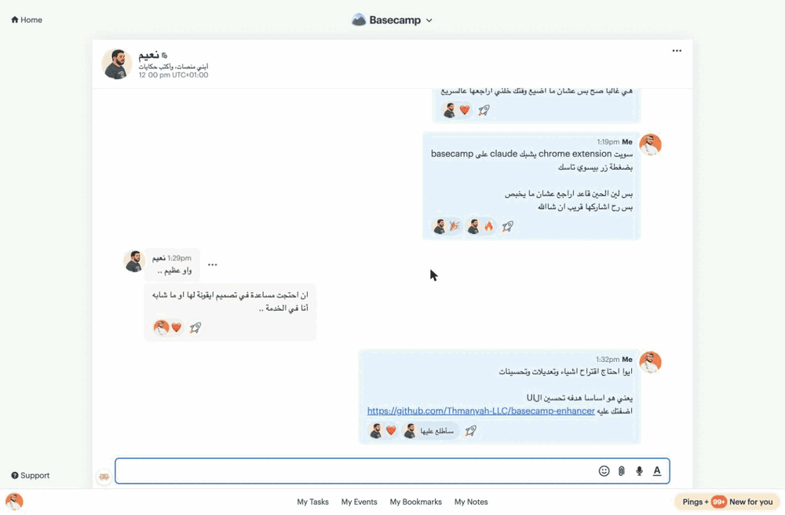

#  Basecamp Enhancer

A tiny Chrome extension (Manifest V3) that runs **only on Basecamp** and adds five quality-of-life fixes:

1. **Relative timestamps** — appends ` (X ago)` to `<time>` elements (e.g. `Jun 2 (6 days ago)`), computed from the `datetime` attribute via `Intl.RelativeTimeFormat`. Refreshed every 60 s. Timestamps within ±1 day are skipped, since Basecamp already shows those as the word "yesterday"/"today"/"tomorrow".
2. **RTL fix** — sets `dir="auto"` on content containers **and editable fields** (textareas, text inputs, the rich-text editor) so Arabic (and other RTL) text renders right-to-left — live as you type — while mixed Latin words/numbers stay correctly ordered, and English content stays LTR.

   
3. **Quick reactions** — one-click boost emoji so you react without opening the "…" picker. The set is **fixed and yours to arrange**: it shows exactly the emoji you configure in the popup, in the order you set them (no automatic recently-used reshuffling). On chat/pings and comments the emoji live in the hover bar (see the demo under **Hover action bar** below); on the main card/message/todo detail they sit inline next to Basecamp's "+".
4. **Hover action bar** — a **Google-Chat–style toolbar** revealed on hover, holding the quick-react emoji **plus the record's whole "…" menu** (**Edit, Reply, Bookmark, Bubble up, Copy link, Delete / Put in the trash, …**) — so you never open the kebab. On **chat/pings** it sits just above each bubble, **matching the bubble's width** (wrapping onto extra rows) so sent/received messages each get a toolbar aligned to their own bubble; on **comments** (cards, todos, messages) it's a compact pill at the top-right. It's Basecamp's own menu (its controllers reconnect, so every action works natively), loads lazily as records scroll into view, and — because it floats — never disturbs Basecamp's layout. Menu items show as **icons only** (labels appear as tooltips) to stay compact. **Configure it from the popup**: choose which menu items appear and drag to reorder them. Exactly one bar shows at a time, and it never appears on the comment box you're still writing in.

   
5. **Thmanyah font** — a font picker for the whole Basecamp UI. Default is **IBM Plex Sans Arabic** (the typeface [thmanyah.com](https://thmanyah.com) renders its articles in; bundled as woff2, SIL OFL licensed); the dropdown also offers the **Thmanyah Sans / Serif Text / Serif Display** brand families, or "Basecamp original" to turn the swap off. Code blocks keep their monospace font, and anything the chosen typeface doesn't cover (emoji etc.) falls back to the system stack.

> **Note:** the extension also contains an experimental **Claude Code launcher** (spawns a local Claude Code worker to handle/watch a conversation), but it's a personal feature that needs a local HQ server, so it's **disabled by default and hidden** in the published build (gated behind a `CC_ENABLED` flag). It isn't part of the five features above.

All run continuously: a `MutationObserver` enhances new content as Basecamp streams it in, and every operation is **idempotent** — re-running never produces duplicate badges, bars, or re-set attributes. Turbo re-renders (cable-stream updates, morph refreshes) are caught via `turbo:*` events so decorations restore instantly instead of flickering.

## Toggles & options

Click the toolbar icon for a popup that enables/disables each feature independently, plus an **emoji editor** for the inline-reaction set (type/paste any emoji — spaces optional; "Reset to defaults" restores the standard set). Changes apply **live** to open Basecamp tabs (no reload) and persist via `chrome.storage.sync`. With all toggles off, the extension fully reverts its changes — plain Basecamp.

## Install (unpacked)

1. Open `chrome://extensions`
2. Toggle **Developer mode** (top-right) on
3. Click **Load unpacked** and select this folder (`basecamp-enhancer/`)
4. Open / reload [app.basecamp.com](https://app.basecamp.com) — you must be signed in

## Files

| File | Purpose |
|------|---------|
| `manifest.json` | MV3 manifest, scoped to `app.basecamp.com` + `3.basecamp.com`, `run_at: document_start`, `storage` permission, `host_permissions` for the local HQ server, toolbar `action`, background service worker |
| `content.js` | All page logic — time badges, RTL auto-dir, hover bars, CC launcher UI, settings/apply-revert, observer wiring |
| `background.js` | Service worker for the (gated) Claude Code launcher — the only code that talks to the local HQ server (content scripts are CORS-bound); inert when `CC_ENABLED` is off |
| `popup.html` / `popup.js` | Toolbar popup with the feature toggles |
| `styles.css` | Badge styling, `unicode-bidi: plaintext` bidi safety net, IBM Plex Sans Arabic `@font-face`s + override rule |
| `fonts/` | Bundled IBM Plex Sans Arabic weights (300–700, woff2) + its OFL license |

## Notes

- Scoped via `content_scripts.matches`; it injects on no other site.
- The RTL selector list (`content.js` → `RTL_SELECTORS`) targets Basecamp content classes — chiefly `.formatted_content` (rendered messages/comments/descriptions), plus `.trix-content`, `.message__content`, `.todo__content`, etc. Add selectors there if a specific view isn't picking up direction.

## Backend setup (Claude Code launcher only)

Only needed if you run a build with `CC_ENABLED = true` (the launcher is off and hidden in the published build — see the note above). The launcher spawns unattended [Claude Code](https://code.claude.com) workers through a small **local** backend on `127.0.0.1:8377`; the extension never talks to anything else.

1. **Claude Code** — installed and signed in.
2. **Remote control on by default** — inside any Claude Code session run `/config` and set **"Enable Remote Control for all sessions"** to `true`. This is what gives every spawned worker its shareable `claude.ai/code/session_…` link.
3. **`uv` and `tmux`** — e.g. `brew install uv tmux` (workers run inside tmux sessions; the backend runs via [`uvx`](https://docs.astral.sh/uv/guides/tools/)).
4. **Create the workspace dir and start the backend.** `BCE_WORKSPACE_DIR` is the backend's base directory (default `~/.basecamp-enhancer/`); each session gets its own folder under `$BCE_WORKSPACE_DIR/workspace/<session-id>/` (working files, `meta.json`, and the `.done` marker that ends its revive-after-reboot lifecycle):

   ```bash
   export BCE_WORKSPACE_DIR="${BCE_WORKSPACE_DIR:-$HOME/.basecamp-enhancer}"
   mkdir -p "$BCE_WORKSPACE_DIR/workspace"
   uvx git+https://github.com/<owner>/<backend-repo>
   ```

   <!-- TODO: replace <owner>/<backend-repo> with the real URL once the backend is published as a standalone package -->

If the extension can't reach the backend when you hit **Launch**, the popover shows this same command inline.
